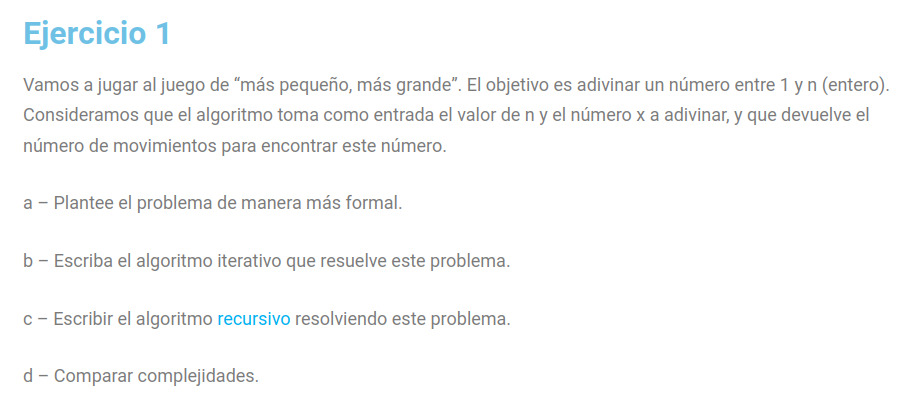

# Divide and conquer

Here you will find a description of the process I followed to solve a problem.

## Instruction: Solve the following exercise

## Solution

### Iterative algorithm
~~~python
def guessNumber(n, x):
    count = 0
    min, max = 1, n
    
    while min <= max:
        mid = (min + max) // 2
        count += 1
        
        if mid == x:
            return count
        elif mid < x:
            min = mid + 1
        else:
            max = mid - 1
    
    return -1 
~~~

**Explanation**
This function called `guessNumber` takes two parameters: n, which represents the range of numbers from 1 to n, and x, which is the number to be guessed within that range. The function uses a binary search algorithm to efficiently guess the number x within the given range. It initializes count to keep track of the number of guesses made. Then, it sets up two pointers, low and high, representing the lower and upper bounds of the search range, respectively.

Inside a while loop, the algorithm calculates the mid point of the current range. It then checks if mid is equal to x, and if so, it returns the number of guesses made so far. If mid is less than x, it updates the low pointer to mid + 1 to discard the lower half of the range. Otherwise, it updates the high pointer to mid - 1 to discard the upper half of the range. The loop continues until finding the number or not.

### Recursion algorithm

~~~python
def guessNumberRecursive(low, high, x, count):
    if min > max:
        return -1 
    
    mid = (min + max) // 2
    count += 1
    
    if mid == x:
        return count
    elif mid < x:
        return guessNumberRecursive(mid + 1, max, x, count)
    else:
        return guessNumberRecursive(min, mid - 1, x, count)

def guessNumber(n, x):
    return guessNumberRecursive(1, n, x, 0)
~~~
**Explanation**

This code defines two functions: `guessNumberRecursive` and `guessNumber`. The guessNumberRecursive function implements a binary search algorithm using recursion to guess a number x within a given range [low, high]. It takes four parameters: the lower bound low, the upper bound high, the number x to be guessed, and the count of guesses made so far.

The function checks if the low pointer is greater than the high pointer, which would indicate that the search range has been exhausted without finding x. In this case, it returns -1. Otherwise, it calculates the mid point of the current range and increments the count of guesses made. Then, it compares mid with x and recursively calls itself with updated bounds depending on whether mid is equal to, less than, or greater than x.

The guessNumber function serves as a wrapper function that initializes the initial bounds and count before calling guessNumberRecursive with these parameters. It returns the result of the recursive call, which represents the number of guesses needed to find x.

### Comparing time complexity

The time complexity of both is O(log n).
